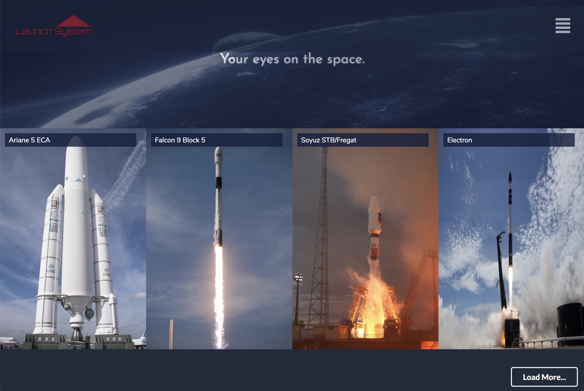

# Launch System

[](https://github.com/prettier/prettier)

Live Demo: [https://launch-system.herokuapp.com](https://launch-system.herokuapp.com)



### Run

In the project directory, install the node modules in server and client:

```shell
yarn
yarn --cwd client
```

Then run the concurrently script to start both server and client:
```shell
yarn run dev
```

A browser will be open at http://localhost:3000

### The stack

- [x] NodeJs
- [x] ExpressJs
- [x] React Fiber
- [x] Semantic UI

### Project Structure

```sh
./                  # Node/Express Files
./client            # Client React Js Files
  ⌙ index.js        # Start Point
./client/components # Main Pages
   ⌙ Homepage.js    # Homepage Container   
./client/features   # Molecules/Organisms
./client/sass       # Styles
```  
